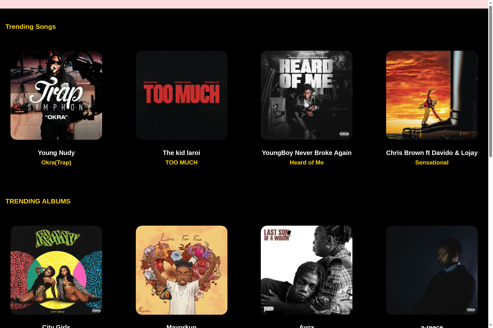

# 🎵 SmokeCity Music - React Web Application



## 🌐 Live Demo
**Live URL:** [https://mr-kennedy-smokecity-react.vercel.app/](https://mr-kennedy-smokecity-react.vercel.app/)
> *🎉 Live and ready to explore!*

---

## 📖 Project Description

**SmokeCity Music** is a modern music discovery and streaming platform built with React.js. This application helps rising stars from all over the world showcase their music and reach a global audience. The platform features trending songs, albums, genre exploration, and user authentication.

### ✨ Key Features
- 🎧 **Music Discovery**: Browse trending songs and albums
- 🌍 **Global Reach**: Discover music from artists worldwide
- 🎼 **Genre Exploration**: Explore different music genres
- 👤 **User Authentication**: Login and signup functionality
- 📱 **Responsive Design**: Works seamlessly on all devices
- 🎵 **Music Player**: Built-in audio player interface
- 🔍 **Search Functionality**: Find your favorite artists and songs

### 🛠️ Tech Stack
- **Frontend**: React.js 18
- **Routing**: React Router DOM
- **Styling**: Pure CSS (No frameworks)
- **Build Tool**: Create React App
- **Deployment**: Vercel (Recommended)

---

## 🚀 Getting Started - For Mr. Kennedy

### Prerequisites
Before you begin, make sure you have the following installed:
- **Node.js** (version 14 or higher) - [Download here](https://nodejs.org/)
- **Git** - [Download here](https://git-scm.com/)
- **GitHub Account** - [Sign up here](https://github.com/)
- **Vercel Account** - [Sign up here](https://vercel.com/)

---

## 💻 Local Development Setup

### Step 1: Clone the Repository
```bash
# Clone your repository (replace with your actual repo URL)
git clone https://github.com/your-username/smokecity-music.git

# Navigate to the project directory
cd smokecity-music
```

### Step 2: Install Dependencies
```bash
# Install all required packages
npm install
```

### Step 3: Start Development Server
```bash
# Start the development server
npm start
```

The application will open automatically in your browser at `http://localhost:3000` 🎉

### Step 4: Build for Production (Optional)
```bash
# Create production build
npm run build
```

---

## 🌐 Deployment on Vercel via GitHub

### Step 1: Push to GitHub
1. **Create a new repository** on GitHub:
   - Go to [GitHub](https://github.com/)
   - Click "New repository"
   - Name it `smokecity-music` (or your preferred name)
   - Make it public or private
   - Don't initialize with README (since you already have one)

2. **Push your local code to GitHub**:
```bash
# Add GitHub remote (replace with your actual repo URL)
git remote add origin https://github.com/your-username/smokecity-music.git

# Add all files to git
git add .

# Commit your changes
git commit -m "Initial commit: SmokeCity Music React App"

# Push to GitHub
git push -u origin main
```

### Step 2: Deploy on Vercel
1. **Connect GitHub to Vercel**:
   - Go to [Vercel](https://vercel.com/)
   - Sign up/Login with your GitHub account
   - Click "New Project"

2. **Import your repository**:
   - Select "Import Git Repository"
   - Choose your `smokecity-music` repository
   - Click "Import"

3. **Configure deployment**:
   - **Framework Preset**: Create React App
   - **Root Directory**: `./` (default)
   - **Build Command**: `npm run build` (default)
   - **Output Directory**: `build` (default)
   - Click "Deploy" 🚀

4. **Get your live URL**:
   - After deployment, Vercel will provide you with a live URL
   - Update the "Live Demo" section in this README with your actual URL

### Step 3: Automatic Deployments
- Every time you push changes to your GitHub repository, Vercel will automatically redeploy your app
- Your changes will be live within minutes! ⚡

---

## 📁 Project Structure
```
smokecity-music/
├── public/                 # Static assets
├── src/
│   ├── components/         # Reusable React components
│   │   ├── Navigation.js   # Navigation menu
│   │   └── Footer.js       # Footer component
│   ├── pages/              # Page components
│   │   ├── Home.js         # Homepage with trending music
│   │   ├── About.js        # About page
│   │   ├── Contact.js      # Contact page
│   │   ├── Genre.js        # Music genres page
│   │   ├── Login.js        # Login page
│   │   ├── SignUp.js       # Registration page
│   │   └── Play.js         # Music player page
│   ├── styles/             # CSS stylesheets
│   │   ├── SmokeCity.css   # Main styles
│   │   ├── about.css       # About page styles
│   │   ├── contact.css     # Contact page styles
│   │   ├── genre.css       # Genre page styles
│   │   ├── login.css       # Login page styles
│   │   ├── signup.css      # Signup page styles
│   │   └── play.css        # Player page styles
│   ├── App.js              # Main app component with routing
│   └── index.js            # App entry point
├── package.json            # Dependencies and scripts
└── README.md              # This file
```

---

## 🎯 Available Scripts

In the project directory, you can run:

### `npm start`
Runs the app in development mode at [http://localhost:3000](http://localhost:3000)

### `npm run build`
Builds the app for production to the `build` folder

### `npm test`
Launches the test runner in interactive watch mode

### `npm run eject`
**Note: This is a one-way operation. Once you eject, you can't go back!**

---

## 🎨 Customization

### Adding New Pages
1. Create a new component in `src/pages/`
2. Add corresponding CSS file in `src/styles/`
3. Update routing in `src/App.js`

### Styling
- All styles are in pure CSS (no frameworks)
- Each page has its own CSS file
- Global styles are in `src/styles/SmokeCity.css`

### Adding Music Content
- Update the music data in the respective page components
- Replace placeholder images with actual album covers
- Update artist information and song details

---

## 🤝 Contributing

1. Fork the repository
2. Create your feature branch (`git checkout -b feature/AmazingFeature`)
3. Commit your changes (`git commit -m 'Add some AmazingFeature'`)
4. Push to the branch (`git push origin feature/AmazingFeature`)
5. Open a Pull Request

---

## 📞 Support

If you encounter any issues during setup or deployment:

1. **Check the console** for error messages
2. **Verify Node.js version** (should be 14+)
3. **Clear npm cache**: `npm cache clean --force`
4. **Delete node_modules and reinstall**:
   ```bash
   rm -rf node_modules package-lock.json
   npm install
   ```

---

## 📄 License

This project is licensed under the MIT License - see the [LICENSE](LICENSE) file for details.

---

## 🎵 About SmokeCity Music

SmokeCity Music was built to help rising stars from all over the world who are incapable of bringing their sound out to the world due to circumstances. Our platform provides a space for independent artists to upload, share, and monetize their music while keeping all their commissions and royalties.

**Join the SmokeCity community and explore the world of music!** 🌟

---

*Made with ❤️ for music lovers worldwide*
